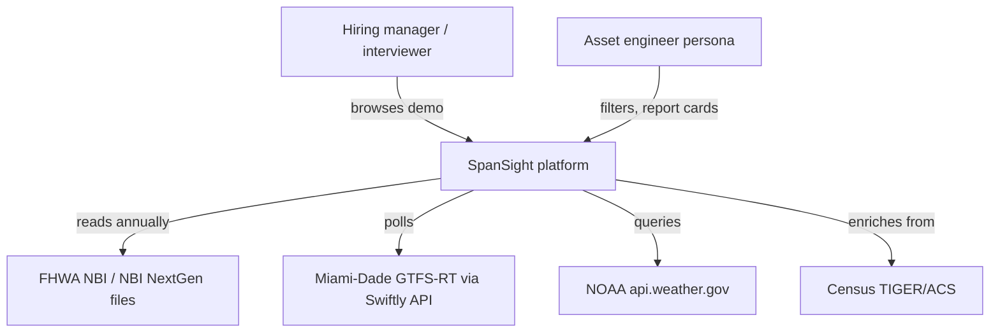
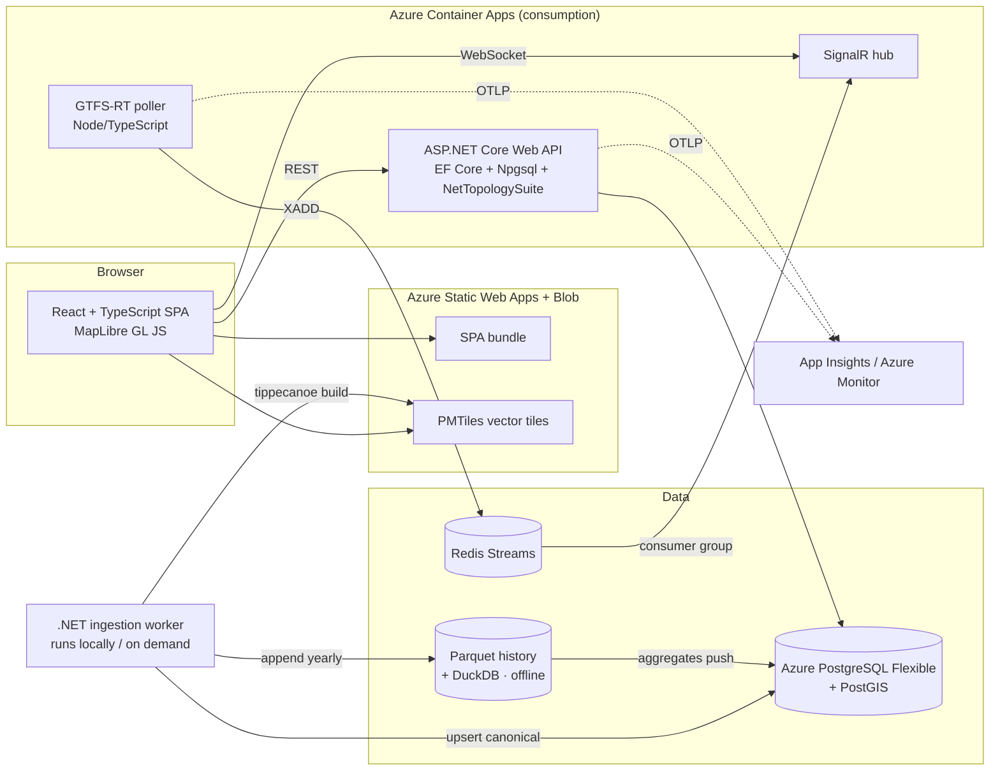
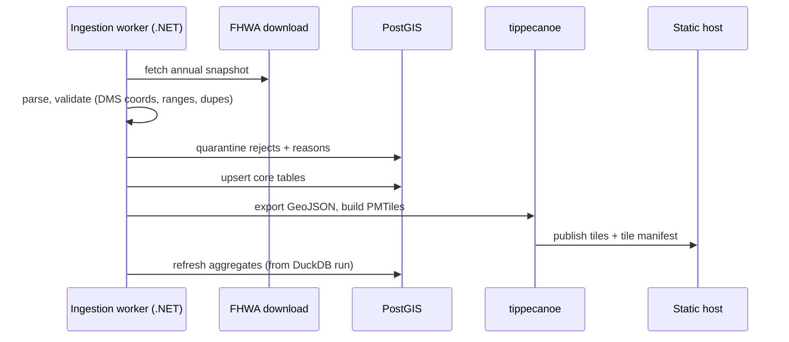
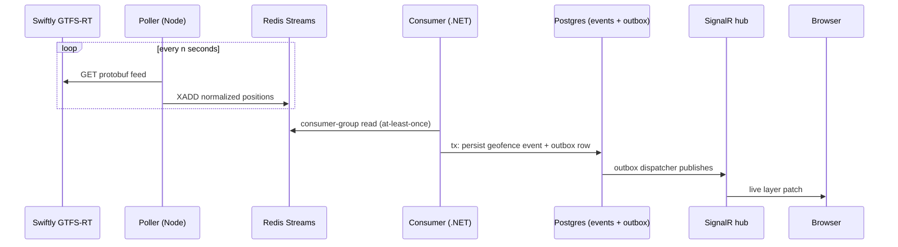

# SpanSight — Architecture

**Design Document** · v0.3 · Author: Raziel Arias · Date: 2026-07-17 (ADR-008 added; v0.2 2026-07-12, ADR-006-B) · Companion to [REQUIREMENTS.md](./REQUIREMENTS.md)

---

## 1. Decision Summary

| Concern | Decision | ADR |
|---|---|---|
| Serving database | PostgreSQL 16 + PostGIS (Azure Database for PostgreSQL in cloud) | ADR-001 |
| Map tiles | Pre-generated PMTiles on static hosting — no tile server | ADR-002 |
| Real-time backbone | Redis Streams + transactional outbox | ADR-003 |
| Live updates to browser | SignalR (WebSocket) | ADR-004 |
| 30-year history | Parquet + DuckDB, offline; only serving data in hosted Postgres | ADR-005 |
| Cloud hosting | Azure end-to-end: Container Apps + PostgreSQL Flexible + Static Web Apps + Blob + App Insights · Bicep IaC · OIDC deploys | ADR-006-B |
| GTFS-RT poller language | Node/TypeScript (isolated secondary-stack showcase) | ADR-007 |
| AI product features (Phase 0.5) | Provider-abstracted LLM assist: NL→filter translation, decoded-record narration, coding-guide RAG — feature-flagged, guardrailed | ADR-008 |

## 2. System Context (C4 L1)

All externals are public federal or county sources — no FDOT systems anywhere (GR-1/GR-2).

## 3. Containers (C4 L2)

**Key shape decisions:** the browser talks mostly to static files (bundle + tiles), keeping the paid/compute surface tiny. The batch worker never runs in the cloud — annual ingestion is a local, deliberate operation whose outputs (Postgres rows, PMTiles, Parquet) are published artifacts.

## 4. Data Architecture

### 4.1 Canonical model + SNBI adapter

Two staging schemas feed one canonical model:

| Layer | Content |
|---|---|
| `staging_legacy` | Raw 1992–2025 Coding Guide records, exact source fidelity |
| `staging_snbi` | Raw 2026+ SNBI/NBI NextGen records |
| `map_crosswalk` | Field-mapping tables derived from the [FHWA crosswalk](https://www.fhwa.dot.gov/bridge/snbi/datacrosswalk.cfm) |
| `core` | Canonical `bridge`, `inspection`, `condition_snapshot` tables — geometry columns (PostGIS), decoded enums, provenance column (`source_format`) |
| `quarantine` | Rejected rows + machine-readable reason codes; feeds the QA report (FR-0.2) |

The API and analytics only ever read `core`. New SNBI vintages become a new staging load + crosswalk pass — no API changes.

### 4.2 Batch pipeline (annual)

### 4.3 Real-time pipeline (Phase 2)

Failure modes documented and tested (FR-2.2): poller crash (stream persists), consumer crash (pending entries reclaimed), hub restart (client reconnect + snapshot re-sync).

## 5. Deployment Topology

### 5.1 Local (daily development)

Single `docker compose up`: Postgres+PostGIS, Redis, API, poller, OTel collector, Grafana+Prometheus (optional profile). SPA via Vite dev server. Ingestion worker run as a CLI (`dotnet run --project src/Ingest`). All development and heavy data work — full-history Parquet/DuckDB analytics, tippecanoe tile builds — happens locally on the dev Mac; only publishable artifacts (aggregate tables, PMTiles) go to Azure.

### 5.2 Cloud (public demo) — all-Azure per ADR-006-B, adopted 2026-07-12

| Component | Azure service | Est. monthly (July 2026 list prices) |
|---|---|---|
| API + SignalR + poller + Redis sidecar | [Container Apps](https://azure.microsoft.com/en-us/pricing/details/container-apps/) consumption (free grant: 180K vCPU-s + 360K GiB-s + 2M req/mo) | $0 while scale-to-zero (Phases 0–1); ~$10–15 with 24/7 poller (Phase 2) |
| Postgres + PostGIS | [Database for PostgreSQL Flexible Server](https://azure.microsoft.com/en-us/pricing/details/postgresql/flexible-server/) B1ms (1 vCPU/2 GiB) + 32 GiB storage | ~$17 |
| SPA | Static Web Apps Free — upgrade to Standard (+$9, SLA) before application season if desired | $0 |
| PMTiles + Parquet archive | Blob Storage (hot for tiles, cool for Parquet backups) | < $1 |
| Observability | Application Insights via OpenTelemetry exporters (first 5 GB/mo ingestion free) | $0 at demo volume with sampling |
| CI/CD | GitHub Actions → Azure via OIDC federation; Bicep IaC | $0 |

**Budget: ≤ $50/mo, alert at $40 (NFR-2 as amended). Expected: ~$18–21 Phases 0–1, ~$30–40 Phase 2.** Optional custom domain ~$12/year. Revert-to-free path documented as Scenario A in [HOSTING-ANALYSIS.md](./HOSTING-ANALYSIS.md).

## 6. Architecture Decision Records (condensed)

### ADR-001 — PostgreSQL + PostGIS over SQL Server / Azure SQL
**Context.** Primary stack is C#/.NET; the natural Microsoft pairing would be SQL Server or Azure SQL (free offer: 100K vCore-s + 32 GB/mo, auto-pauses when exhausted). The project is fundamentally geospatial.
**Decision.** PostgreSQL 16 + PostGIS everywhere (Docker locally, Neon hosted).
**Rationale.** (1) PostGIS is the geospatial industry standard — richer spatial functions/indexes, and the open geo toolchain (GDAL, tippecanoe, QGIS, DuckDB spatial) assumes it; SQL Server spatial covers only basics. (2) Zero licensing at any scale; SQL Server Express caps at 10 GB / ~1.4 GB memory. (3) Azure SQL free tier auto-pause is the wrong failure mode for a demo that must be up during application season. (4) No native SQL Server on macOS/ARM — local dev friction. (5) Hiring signal: resume already implies MSSQL from government .NET work; EF Core + Npgsql + PostGIS adds breadth with an in-demand pairing.
**Consequences.** EF Core keeps ~90% of data access provider-agnostic (documented swap path); we forgo T-SQL-specific features; spatial SQL is written PostGIS-native by design.

### ADR-002 — Pre-generated PMTiles over a live tile server
**Decision.** tippecanoe builds vector tiles into a single PMTiles file at ingestion time; served as a static asset with HTTP range requests.
**Rationale.** NBI changes annually — rendering tiles per-request buys nothing. Static tiles cost $0, are CDN-cacheable, and survive traffic spikes.
**Consequences.** Filter-driven styling happens client-side (MapLibre expressions) or via the API for detail queries; tile regeneration is a pipeline step.

### ADR-003 — Redis Streams + transactional outbox
**Decision.** Poller writes to Redis Streams; .NET consumer persists events and an outbox row in one transaction; dispatcher publishes to SignalR.
**Rationale.** Deliberately exercises the messaging patterns in the study plan with honest at-least-once semantics and testable failure modes. Kafka would be résumé-driven overkill at this scale.

### ADR-004 — SignalR for live browser updates
**Decision.** ASP.NET Core SignalR hub pushes vehicle/geofence updates.
**Rationale.** Native .NET, trivial to host in the same container, automatic reconnect; the .NET-idiomatic answer an interviewer expects.

### ADR-005 — Parquet + DuckDB for history; hosted Postgres stays small
**Decision.** All 30+ yearly vintages live as Parquet (repo/object storage); DuckDB computes trends/transition matrices offline; results land in Postgres as compact aggregate tables.
**Rationale.** Keeping 30+ vintages out of the serving DB lets it stay on the cheapest tier (B1ms / 32 GiB) and fast; analytics over columnar Parquet is faster anyway and is its own talking point (right tool per workload).

### ADR-006 — Multi-vendor free tiers (superseded)
**Original decision.** ACA + Neon + Cloudflare/GitHub Pages + Grafana Cloud, optimizing solely for $0 under the original NFR-2. Full analysis and alternatives preserved in [HOSTING-ANALYSIS.md](./HOSTING-ANALYSIS.md).

### ADR-006-B — Azure consolidation (ADOPTED 2026-07-12)
**Context.** Owner approved a $50/mo budget for the initial phases and prefers one platform. A home-cluster hybrid was analyzed (HOSTING-ANALYSIS §6) and declined — all local work happens on the dev Mac.
**Decision.** All runtime services on Azure per §5.2: Container Apps (API/SignalR/poller + demo-grade Redis sidecar), Azure Database for PostgreSQL Flexible Server with PostGIS (ADR-001 unchanged), Static Web Apps, Blob Storage (PMTiles + Parquet archive), Application Insights via OpenTelemetry. GitHub remains for repo/CI with OIDC-federated deploys; **every Azure resource is provisioned with Bicep from day one**.
**Rationale.** In-region API↔DB latency; one bill, one IAM; managed identity end-to-end (no connection-string secrets — deliberate showcase); resume-aligned Azure story; portable OSS components (Postgres/Redis/containers/OTel) keep exit costs low.
**Consequences.** Grafana Cloud dropped (App Insights in cloud; local compose keeps Grafana/Prometheus); budget alert at $40 with cost as a first-class ops-dashboard metric; cold starts acceptable while scale-to-zero.

### ADR-007 — GTFS-RT poller in Node/TypeScript
**Decision.** The one non-.NET service is the GTFS-RT poller.
**Rationale.** Showcases the declared secondary stack in a small, isolated, low-risk component (protobuf decode → Redis write); demonstrates polyglot judgment rather than monoculture.
**Consequences.** Two runtimes in CI; flip-to-.NET path is one worker class if consolidation is ever preferred.

### ADR-008 — AI product features: guardrailed LLM assist (ADOPTED 2026-07-17)
**Context.** Owner added AI features to scope (SRS v1.1, Phase 0.5: FR-AI.1 natural-language query → filters, FR-AI.2 plain-English record narration, FR-AI.3 RAG over the public FHWA coding guide). Constraints: GR-6 (nothing that reads as engineering judgment), NFR-2 (budget ≤$50/mo all-in), NFR-4 (no secrets in repo), and demo reliability.
**Decision.**
1. **Abstraction first.** A small `ISpanSightAssistant` port in `SpanSight.Core.Ai` with provider adapters in the API host; first adapter targets the Anthropic API (personal account), Haiku-class model by default. Provider/model/pins chosen at implementation time and recorded here.
2. **Guardrails as architecture, not prompts only.** FR-AI.1 output is **constrained to the existing validated `FilterSpec`** (JSON-schema structured output → same validation path as hand-typed filters; the model can only say what a filter form could say). FR-AI.2 narrates only published fields already shown in the drawer, template-framed, with the GR-6 disclaimer attached to every AI-authored string. No user text ever reaches SQL; no model-initiated tool calls.
3. **Prompt-injection posture.** User input is data, never instructions: single-turn, schema-bound calls; no conversation memory; no access to anything but the request payload.
4. **Cost control.** Feature-flagged off by default (`Ai:Enabled=false`); per-request token caps; response cache (Redis) keyed on normalized input; daily request budget guard that trips the feature to "temporarily unavailable"; target ≤$5/mo inside NFR-2, reviewed at gates. API key via user-secrets locally / Container Apps secrets in cloud.
5. **RAG (FR-AI.3) deferred one step.** Corpus is the public FHWA Coding Guide/SNBI definitions; retrieval lands as pgvector in the same Postgres (no new datastore). Embedding provider decided at build time (local ONNX model vs hosted API) with its own mini-trade-study appended here.
**Rationale.** Demonstrates the AI-integration skill hiring teams now screen for, with the engineering story (schema-constrained outputs, injection posture, cost governors, provider abstraction) — not a chat box bolted on. Same-Postgres pgvector keeps ADR-001/ADR-006-B intact.
**Consequences.** LLM spend joins the gate-time budget check; `Ai:Enabled` stays false until FR-AI acceptance criteria are elaborated and met (SDLC §3); the disclaimer footer language extends to AI-authored text (GR-6).
**Implementation pins (2026-07-18, FR-AI.1).** Official Anthropic C# SDK (`Anthropic` 12.9.0) behind `ISpanSightAssistant`; model `claude-haiku-4-5` (the §4 cost call), single-turn with structured outputs (`output_config.format` JSON schema). The schema is the *filter rail's* predicate — conditions, state, type groups, built-before, min AADT, plus an `unsupported` list — a deliberately tighter constraint than the full API filter (no bbox/county/materials via AI until the rail grows them). Interpretation strings are rendered in code from validated values, so no model-authored text is ever displayed. Response cache is in-memory (`IMemoryCache`) until the Phase 2 Redis sidecar exists — revisit then. A deterministic stub provider (`Ai:Provider=stub`) exercises the full pipeline in CI and local dev with zero spend; the Anthropic key enters only via user-secrets / Container Apps secrets.

## 7. Cross-Cutting Concerns

- **Security.** Public read-only API in P0–P2: no auth, but rate limiting (ASP.NET Core rate limiter), strict CORS, security headers, no PII in the data. Secrets: .NET user-secrets locally, Container Apps secrets in cloud. Dependency + container scanning in CI. OIDC arrives only with FR-3.1.
- **Configuration.** Standard ASP.NET Core layering (appsettings → env vars); one image promoted across environments.
- **Testing.** xUnit unit tests (parsers, crosswalk mapping, geofence math) · integration tests against real Postgres+Redis via Testcontainers · one Playwright smoke path (load map → filter → open bridge) in CI pre-deploy.
- **Observability.** OpenTelemetry SDKs in API, poller, and SPA (web vitals + fetch traces); W3C trace context propagated browser → API → DB; RED dashboard + ingestion row-count/error-rate metrics; alert on demo-down and on Azure grant burn rate.
- **CI/CD.** GitHub Actions with OIDC federation to Azure (no stored cloud credentials): build → test → scan → publish image → Bicep deploy → smoke test. Trunk-based; `main` always deployable (Roadmap rule, REQUIREMENTS §9).

## 8. Requirement Traceability (spot checks)

| Requirement | Architectural answer |
|---|---|
| GR-1/GR-2 zero FDOT | Externals limited to FHWA/Census/NOAA/Miami-Dade (§2) |
| FR-0.2 data quality | Quarantine schema + QA report (§4.1) |
| FR-1.3 deterioration model | DuckDB offline computation → aggregate tables (ADR-005) |
| FR-2.2 outbox | §4.3 + ADR-003 with tested failure modes |
| NFR-1 p95 < 300 ms | Static tiles remove map load from API; indexed core tables; paginated queries |
| NFR-2 ≤$50/mo budget | §5.2 all-Azure topology; $40 budget alert; cost on ops dashboard |
| SNBI dual-format | Staging + crosswalk + canonical `core` (§4.1) |

## 9. Open Items

- **OI-1** ~~Cloud Redis~~ **Resolved:** Redis sidecar container in Container Apps for the demo (ADR-006-B); managed Redis only at product stage.
- **OI-2** ~~Project name~~ **Resolved:** SpanSight (OQ-1) — locked 2026-07-12.
- **OI-3** Request Swiftly API access in week 1 (lead-time hedge, R-4).
- **OI-4** Custom domain (~$12/yr) — optional polish before applications.

---

*ADR-001 rationale discussed and accepted 2026-07-12. Architecture sources: [Azure Container Apps pricing](https://azure.microsoft.com/en-us/pricing/details/container-apps/) · [Azure SQL free offer](https://learn.microsoft.com/en-us/azure/azure-sql/database/free-offer?view=azuresql) · [Grafana Cloud free tier](https://grafana.com/pricing/) · [Render free tier](https://render.com/docs/free) · [Fly.io trial policy](https://fly.io/docs/about/free-trial/) · [FHWA SNBI crosswalk](https://www.fhwa.dot.gov/bridge/snbi/datacrosswalk.cfm)*

