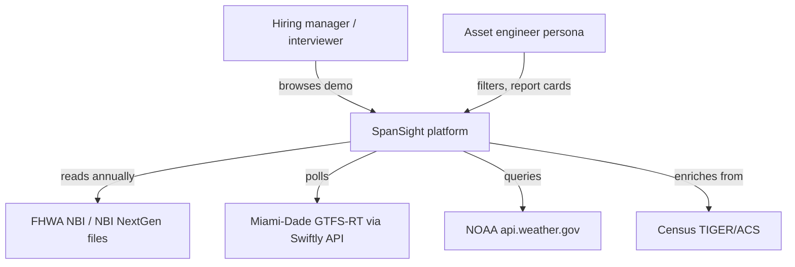
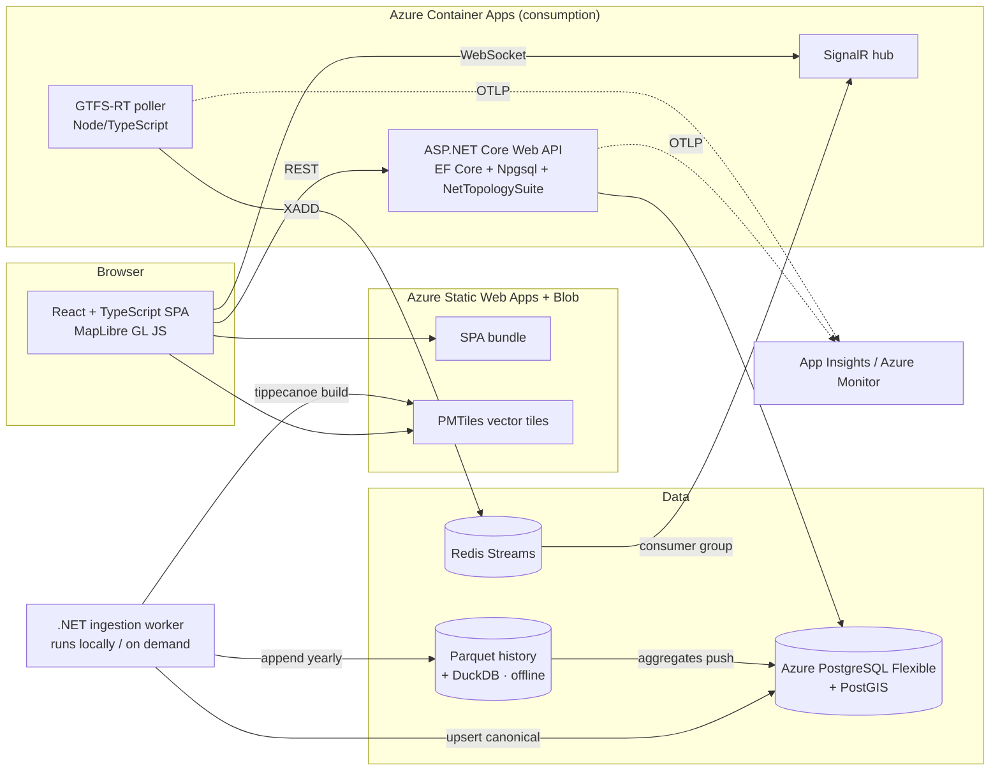
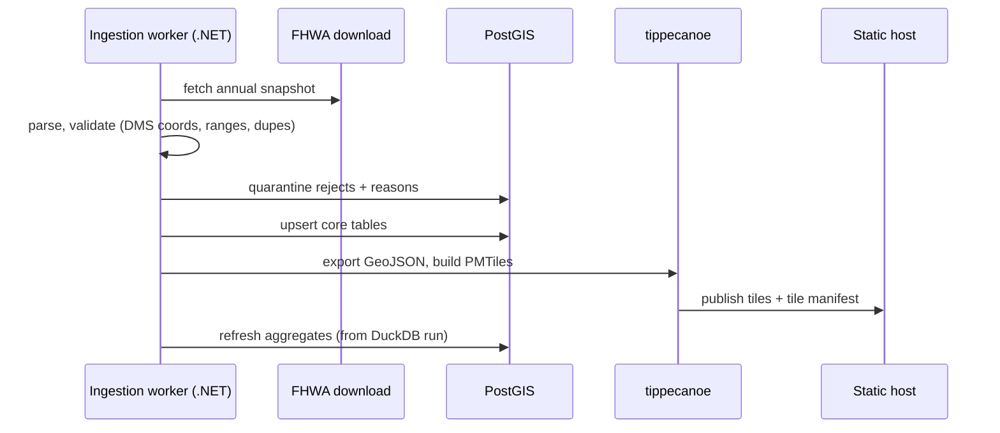
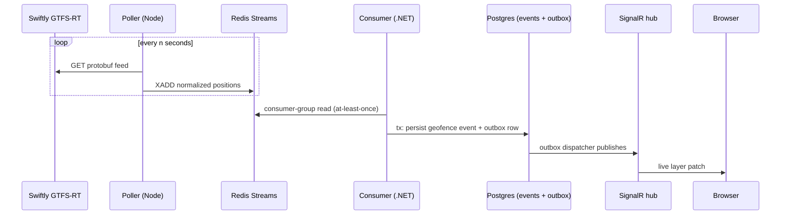

# SpanSight — Architecture

**Design Document** · v0.4 · Author: Raziel Arias · Date: 2026-07-26 (Azure-iconography diagrams §3/§5.2 + §10 technology stack; v0.3 2026-07-17, ADR-008; v0.2 2026-07-12, ADR-006-B) · Companion to [REQUIREMENTS.md](./REQUIREMENTS.md)

---

## 1. Decision Summary

| Concern | Decision | ADR |
|---|---|---|
| Serving database | PostgreSQL 16 + PostGIS (Azure Database for PostgreSQL in cloud) | ADR-001 |
| Map tiles | Pre-generated PMTiles on static hosting — no tile server | ADR-002 |
| Real-time backbone | Redis Streams + transactional outbox | ADR-003 |
| Live updates to browser | SignalR (WebSocket) | ADR-004 |
| 30-year history | Parquet + DuckDB, offline; only serving data in hosted Postgres | ADR-005 |
| Cloud hosting | Azure end-to-end: Container Apps + PostgreSQL Flexible + Static Web Apps + Blob + App Insights · Bicep IaC · OIDC deploys | ADR-006-B |
| GTFS-RT poller language | Node/TypeScript (isolated secondary-stack showcase) | ADR-007 |
| AI product features (Phase 0.5) | Provider-abstracted LLM assist: NL→filter translation, decoded-record narration, coding-guide RAG — feature-flagged, guardrailed | ADR-008 |

## 2. System Context (C4 L1)

```mermaid
flowchart TD
    HM["Hiring manager / interviewer"] -->|browses demo| SS
    AE["Asset engineer persona"] -->|filters, report cards| SS
    SS["SpanSight platform"]
    SS -->|reads annually| NBI["FHWA NBI / NBI NextGen files"]
    SS -->|polls| MDT["Miami-Dade GTFS-RT via Swiftly API"]
    SS -->|queries| NOAA["NOAA api.weather.gov"]
    SS -->|enriches from| CEN["Census TIGER/ACS"]
```

All externals are public federal or county sources — no FDOT systems anywhere (GR-1/GR-2).

## 3. Containers (C4 L2)

Mermaid source (text-editable fallback)

```mermaid
flowchart LR
    subgraph Browser
        SPA["React + TypeScript SPA<br/>MapLibre GL JS"]
    end
    subgraph Static["Azure Static Web Apps + Blob"]
        ASSETS["SPA bundle"]
        TILES["PMTiles vector tiles"]
    end
    subgraph ACA["Azure Container Apps (consumption)"]
        API["ASP.NET Core Web API<br/>EF Core + Npgsql + NetTopologySuite"]
        HUB["SignalR hub"]
        POLLER["GTFS-RT poller<br/>Node/TypeScript"]
    end
    subgraph DataStores["Data"]
        PG[("Azure PostgreSQL Flexible<br/>+ PostGIS")]
        REDIS[("Redis Streams")]
        PARQ[("Parquet history<br/>+ DuckDB · offline")]
    end
    BATCH[".NET ingestion worker<br/>runs locally / on demand"]

    SPA --> ASSETS
    SPA --> TILES
    SPA -->|REST| API
    SPA -->|WebSocket| HUB
    API --> PG
    POLLER -->|XADD| REDIS
    REDIS -->|consumer group| HUB
    BATCH -->|upsert canonical| PG
    BATCH -->|tippecanoe build| TILES
    BATCH -->|append yearly| PARQ
    PARQ -->|aggregates push| PG
    API -.->|OTLP| GC["App Insights / Azure Monitor"]
    POLLER -.->|OTLP| GC
```

**Key shape decisions:** the browser talks mostly to static files (bundle + tiles), keeping the paid/compute surface tiny. The batch worker never runs in the cloud — annual ingestion is a local, deliberate operation whose outputs (Postgres rows, PMTiles, Parquet) are published artifacts.

## 4. Data Architecture

### 4.1 Canonical model + SNBI adapter

Two staging schemas feed one canonical model:

| Layer | Content |
|---|---|
| `staging_legacy` | Raw 1992–2025 Coding Guide records, exact source fidelity |
| `staging_snbi` | Raw 2026+ SNBI/NBI NextGen records |
| `map_crosswalk` | Field-mapping tables derived from the [FHWA crosswalk](https://www.fhwa.dot.gov/bridge/snbi/datacrosswalk.cfm) |
| `core` | Canonical `bridge`, `inspection`, `condition_snapshot` tables — geometry columns (PostGIS), decoded enums, provenance column (`source_format`) |
| `quarantine` | Rejected rows + machine-readable reason codes; feeds the QA report (FR-0.2) |

The API and analytics only ever read `core`. New SNBI vintages become a new staging load + crosswalk pass — no API changes.

### 4.2 Batch pipeline (annual)

```mermaid
sequenceDiagram
    participant W as Ingestion worker (.NET)
    participant F as FHWA download
    participant PG as PostGIS
    participant T as tippecanoe
    participant CDN as Static host
    W->>F: fetch annual snapshot
    W->>W: parse, validate (DMS coords, ranges, dupes)
    W->>PG: quarantine rejects + reasons
    W->>PG: upsert core tables
    W->>T: export GeoJSON, build PMTiles
    T->>CDN: publish tiles + tile manifest
    W->>PG: refresh aggregates (from DuckDB run)
```

### 4.3 Real-time pipeline (Phase 2)

```mermaid
sequenceDiagram
    participant S as Swiftly GTFS-RT
    participant P as Poller (Node)
    participant R as Redis Streams
    participant C as Consumer (.NET)
    participant DB as Postgres (events + outbox)
    participant H as SignalR hub
    participant U as Browser
    loop every n seconds
        P->>S: GET protobuf feed
        P->>R: XADD normalized positions
    end
    C->>R: consumer-group read (at-least-once)
    C->>DB: tx: persist geofence event + outbox row
    DB->>H: outbox dispatcher publishes
    H->>U: live layer patch
```

Failure modes documented and tested (FR-2.2): poller crash (stream persists), consumer crash (pending entries reclaimed), hub restart (client reconnect + snapshot re-sync).

## 5. Deployment Topology

### 5.1 Local (daily development)

Single `docker compose up`: Postgres+PostGIS, Redis, API, poller, OTel collector, Grafana+Prometheus (optional profile). SPA via Vite dev server. Ingestion worker run as a CLI (`dotnet run --project src/Ingest`). All development and heavy data work — full-history Parquet/DuckDB analytics, tippecanoe tile builds — happens locally on the dev Mac; only publishable artifacts (aggregate tables, PMTiles) go to Azure.

### 5.2 Cloud (public demo) — all-Azure per ADR-006-B, adopted 2026-07-12

![SpanSight Azure deployment topology in Azure iconography: visitors reach www.spansights.com through GoDaddy DNS; inside resource group rg-spansight-demo (South Central US) sit Static Web Apps, the Container Apps environment running the API with a system-assigned managed identity, PostgreSQL Flexible Server with Entra-token auth, the storage account with the public tiles container and private parquet-archive, and the monitoring column (App Insights, Log Analytics, Azure Monitor); the subscription-scope cost budget and the dark Anthropic API sit outside the boundary; GitHub Actions deploys via OIDC federation and the dev Mac performs local data operations](./diagrams/deployment-azure.svg)

*The deployed shape as provisioned by `infra/main.bicep` — resource names are the live demo's. Solid arrows are request/data paths; dashed lines are DNS, identity, telemetry, and the feature-flagged AI call. Diagram SVGs are self-contained (official Azure architecture icons © Microsoft, used per the [icon terms](https://learn.microsoft.com/en-us/azure/architecture/icons/) to represent Azure services).*

| Component | Azure service | Est. monthly (July 2026 list prices) |
|---|---|---|
| API + SignalR + poller + Redis sidecar | [Container Apps](https://azure.microsoft.com/en-us/pricing/details/container-apps/) consumption (free grant: 180K vCPU-s + 360K GiB-s + 2M req/mo) | $0 while scale-to-zero (Phases 0–1); ~$10–15 with 24/7 poller (Phase 2) |
| Postgres + PostGIS | [Database for PostgreSQL Flexible Server](https://azure.microsoft.com/en-us/pricing/details/postgresql/flexible-server/) B1ms (1 vCPU/2 GiB) + 32 GiB storage | ~$17 |
| SPA | Static Web Apps Free — upgrade to Standard (+$9, SLA) before application season if desired | $0 |
| PMTiles + Parquet archive | Blob Storage (hot for tiles, cool for Parquet backups) | < $1 |
| Observability | Application Insights via OpenTelemetry exporters (first 5 GB/mo ingestion free) | $0 at demo volume with sampling |
| CI/CD | GitHub Actions → Azure via OIDC federation; Bicep IaC | $0 |

**Budget: ≤ $50/mo, alert at $40 (NFR-2 as amended). Expected: ~$18–21 Phases 0–1, ~$30–40 Phase 2.** Optional custom domain ~$12/year. Revert-to-free path documented as Scenario A in [HOSTING-ANALYSIS.md](./HOSTING-ANALYSIS.md).

## 6. Architecture Decision Records (condensed)

### ADR-001 — PostgreSQL + PostGIS over SQL Server / Azure SQL
**Context.** Primary stack is C#/.NET; the natural Microsoft pairing would be SQL Server or Azure SQL (free offer: 100K vCore-s + 32 GB/mo, auto-pauses when exhausted). The project is fundamentally geospatial.
**Decision.** PostgreSQL 16 + PostGIS everywhere (Docker locally, Neon hosted).
**Rationale.** (1) PostGIS is the geospatial industry standard — richer spatial functions/indexes, and the open geo toolchain (GDAL, tippecanoe, QGIS, DuckDB spatial) assumes it; SQL Server spatial covers only basics. (2) Zero licensing at any scale; SQL Server Express caps at 10 GB / ~1.4 GB memory. (3) Azure SQL free tier auto-pause is the wrong failure mode for a demo that must be up during application season. (4) No native SQL Server on macOS/ARM — local dev friction. (5) Hiring signal: resume already implies MSSQL from government .NET work; EF Core + Npgsql + PostGIS adds breadth with an in-demand pairing.
**Consequences.** EF Core keeps ~90% of data access provider-agnostic (documented swap path); we forgo T-SQL-specific features; spatial SQL is written PostGIS-native by design.

### ADR-002 — Pre-generated PMTiles over a live tile server
**Decision.** tippecanoe builds vector tiles into a single PMTiles file at ingestion time; served as a static asset with HTTP range requests.
**Rationale.** NBI changes annually — rendering tiles per-request buys nothing. Static tiles cost $0, are CDN-cacheable, and survive traffic spikes.
**Consequences.** Filter-driven styling happens client-side (MapLibre expressions) or via the API for detail queries; tile regeneration is a pipeline step.

### ADR-003 — Redis Streams + transactional outbox
**Decision.** Poller writes to Redis Streams; .NET consumer persists events and an outbox row in one transaction; dispatcher publishes to SignalR.
**Rationale.** Deliberately exercises the messaging patterns in the study plan with honest at-least-once semantics and testable failure modes. Kafka would be résumé-driven overkill at this scale.

### ADR-004 — SignalR for live browser updates
**Decision.** ASP.NET Core SignalR hub pushes vehicle/geofence updates.
**Rationale.** Native .NET, trivial to host in the same container, automatic reconnect; the .NET-idiomatic answer an interviewer expects.

### ADR-005 — Parquet + DuckDB for history; hosted Postgres stays small
**Decision.** All 30+ yearly vintages live as Parquet (repo/object storage); DuckDB computes trends/transition matrices offline; results land in Postgres as compact aggregate tables.
**Rationale.** Keeping 30+ vintages out of the serving DB lets it stay on the cheapest tier (B1ms / 32 GiB) and fast; analytics over columnar Parquet is faster anyway and is its own talking point (right tool per workload).

### ADR-006 — Multi-vendor free tiers (superseded)
**Original decision.** ACA + Neon + Cloudflare/GitHub Pages + Grafana Cloud, optimizing solely for $0 under the original NFR-2. Full analysis and alternatives preserved in [HOSTING-ANALYSIS.md](./HOSTING-ANALYSIS.md).

### ADR-006-B — Azure consolidation (ADOPTED 2026-07-12)
**Context.** Owner approved a $50/mo budget for the initial phases and prefers one platform. A home-cluster hybrid was analyzed (HOSTING-ANALYSIS §6) and declined — all local work happens on the dev Mac.
**Decision.** All runtime services on Azure per §5.2: Container Apps (API/SignalR/poller + demo-grade Redis sidecar), Azure Database for PostgreSQL Flexible Server with PostGIS (ADR-001 unchanged), Static Web Apps, Blob Storage (PMTiles + Parquet archive), Application Insights via OpenTelemetry. GitHub remains for repo/CI with OIDC-federated deploys; **every Azure resource is provisioned with Bicep from day one**.
**Rationale.** In-region API↔DB latency; one bill, one IAM; managed identity end-to-end (no connection-string secrets — deliberate showcase); resume-aligned Azure story; portable OSS components (Postgres/Redis/containers/OTel) keep exit costs low.
**Consequences.** Grafana Cloud dropped (App Insights in cloud; local compose keeps Grafana/Prometheus); budget alert at $40 with cost as a first-class ops-dashboard metric; cold starts acceptable while scale-to-zero.

### ADR-007 — GTFS-RT poller in Node/TypeScript
**Decision.** The one non-.NET service is the GTFS-RT poller.
**Rationale.** Showcases the declared secondary stack in a small, isolated, low-risk component (protobuf decode → Redis write); demonstrates polyglot judgment rather than monoculture.
**Consequences.** Two runtimes in CI; flip-to-.NET path is one worker class if consolidation is ever preferred.

### ADR-008 — AI product features: guardrailed LLM assist (ADOPTED 2026-07-17)
**Context.** Owner added AI features to scope (SRS v1.1, Phase 0.5: FR-AI.1 natural-language query → filters, FR-AI.2 plain-English record narration, FR-AI.3 RAG over the public FHWA coding guide). Constraints: GR-6 (nothing that reads as engineering judgment), NFR-2 (budget ≤$50/mo all-in), NFR-4 (no secrets in repo), and demo reliability.
**Decision.**
1. **Abstraction first.** A small `ISpanSightAssistant` port in `SpanSight.Core.Ai` with provider adapters in the API host; first adapter targets the Anthropic API (personal account), Haiku-class model by default. Provider/model/pins chosen at implementation time and recorded here.
2. **Guardrails as architecture, not prompts only.** FR-AI.1 output is **constrained to the existing validated `FilterSpec`** (JSON-schema structured output → same validation path as hand-typed filters; the model can only say what a filter form could say). FR-AI.2 narrates only published fields already shown in the drawer, template-framed, with the GR-6 disclaimer attached to every AI-authored string. No user text ever reaches SQL; no model-initiated tool calls.
3. **Prompt-injection posture.** User input is data, never instructions: single-turn, schema-bound calls; no conversation memory; no access to anything but the request payload.
4. **Cost control.** Feature-flagged off by default (`Ai:Enabled=false`); per-request token caps; response cache (Redis) keyed on normalized input; daily request budget guard that trips the feature to "temporarily unavailable"; target ≤$5/mo inside NFR-2, reviewed at gates. API key via user-secrets locally / Container Apps secrets in cloud.
5. **RAG (FR-AI.3) deferred one step.** Corpus is the public FHWA Coding Guide/SNBI definitions; retrieval lands as pgvector in the same Postgres (no new datastore). Embedding provider decided at build time (local ONNX model vs hosted API) with its own mini-trade-study appended here.
**Rationale.** Demonstrates the AI-integration skill hiring teams now screen for, with the engineering story (schema-constrained outputs, injection posture, cost governors, provider abstraction) — not a chat box bolted on. Same-Postgres pgvector keeps ADR-001/ADR-006-B intact.
**Consequences.** LLM spend joins the gate-time budget check; `Ai:Enabled` stays false until FR-AI acceptance criteria are elaborated and met (SDLC §3); the disclaimer footer language extends to AI-authored text (GR-6).
**Implementation pins (2026-07-18, FR-AI.1).** Official Anthropic C# SDK (`Anthropic` 12.9.0) behind `ISpanSightAssistant`; model `claude-haiku-4-5` (the §4 cost call), single-turn with structured outputs (`output_config.format` JSON schema). The schema is the *filter rail's* predicate — conditions, state, type groups, built-before, min AADT, plus an `unsupported` list — a deliberately tighter constraint than the full API filter (no bbox/county/materials via AI until the rail grows them). Interpretation strings are rendered in code from validated values, so no model-authored text is ever displayed. Response cache is in-memory (`IMemoryCache`) until the Phase 2 Redis sidecar exists — revisit then. A deterministic stub provider (`Ai:Provider=stub`) exercises the full pipeline in CI and local dev with zero spend; the Anthropic key enters only via user-secrets / Container Apps secrets.

## 7. Cross-Cutting Concerns

- **Security.** Public read-only API in P0–P2: no auth, but rate limiting (ASP.NET Core rate limiter), strict CORS, security headers, no PII in the data. Secrets: .NET user-secrets locally, Container Apps secrets in cloud. Dependency + container scanning in CI. OIDC arrives only with FR-3.1.
- **Configuration.** Standard ASP.NET Core layering (appsettings → env vars); one image promoted across environments.
- **Testing.** xUnit unit tests (parsers, crosswalk mapping, geofence math) · integration tests against real Postgres+Redis via Testcontainers · one Playwright smoke path (load map → filter → open bridge) in CI pre-deploy.
- **Observability.** OpenTelemetry SDKs in API, poller, and SPA (web vitals + fetch traces); W3C trace context propagated browser → API → DB; RED dashboard + ingestion row-count/error-rate metrics; alert on demo-down and on Azure grant burn rate.
- **CI/CD.** GitHub Actions with OIDC federation to Azure (no stored cloud credentials): build → test → scan → publish image → Bicep deploy → smoke test. Trunk-based; `main` always deployable (Roadmap rule, REQUIREMENTS §9).

## 8. Requirement Traceability (spot checks)

| Requirement | Architectural answer |
|---|---|
| GR-1/GR-2 zero FDOT | Externals limited to FHWA/Census/NOAA/Miami-Dade (§2) |
| FR-0.2 data quality | Quarantine schema + QA report (§4.1) |
| FR-1.3 deterioration model | DuckDB offline computation → aggregate tables (ADR-005) |
| FR-2.2 outbox | §4.3 + ADR-003 with tested failure modes |
| NFR-1 p95 < 300 ms | Static tiles remove map load from API; indexed core tables; paginated queries |
| NFR-2 ≤$50/mo budget | §5.2 all-Azure topology; $40 budget alert; cost on ops dashboard |
| SNBI dual-format | Staging + crosswalk + canonical `core` (§4.1) |

## 9. Open Items

- **OI-1** ~~Cloud Redis~~ **Resolved:** Redis sidecar container in Container Apps for the demo (ADR-006-B); managed Redis only at product stage.
- **OI-2** ~~Project name~~ **Resolved:** SpanSight (OQ-1) — locked 2026-07-12.
- **OI-3** Request Swiftly API access in week 1 (lead-time hedge, R-4).
- **OI-4** Custom domain (~$12/yr) — optional polish before applications.

## 10. Technology Stack

Every technology in the project, with what it is and the job it does here. Everything listed is in the repo and exercised by CI today unless marked **Phase 2 (planned)**; versions are the pins current at v0.4 (see `Directory.Packages.props`, `web/package.json`, `global.json`).

### 10.1 Languages & runtimes

| Technology | What it is & how SpanSight uses it |
|---|---|
| **C# 13 / .NET 10 LTS** (SDK 10.0.300) | Primary language and runtime. Everything server-side is C#: the domain library (`SpanSight.Core`), the ASP.NET Core API, the ingestion CLI, and all unit/integration tests. |
| **TypeScript 6** | Statically-typed superset of JavaScript; the entire SPA (`web/`) is TypeScript in strict mode, compiled by `tsc` and bundled by Vite. Declared secondary stack (ADR-007) — the Phase 2 GTFS-RT poller will be Node/TypeScript. |
| **Node.js 24 LTS** | JavaScript runtime; powers the web toolchain (Vite, Playwright, oxlint) and CI web jobs today, and hosts the GTFS-RT poller in Phase 2. |
| **Python 3** | Utility scripting where it beats shell: the CI coverage gate (`tools/coverage-gate.py`), the npm-audit gate with its time-boxed allowlist, and the test-fixture generator (`tools/dev/make_fixture.py`). |
| **Bash** | Operational glue: `tools/build-tiles.sh` (tile pipeline), `tools/vintages/download.sh` + `convert.sh` (34-vintage NBI acquisition/normalization), all written to fail loudly (`set -euo pipefail`). |
| **SQL (PostGIS dialect)** | Spatial queries, EF Core migrations, and the DuckDB SQL used for vintage normalization and Parquet writes. Spatial SQL is written PostGIS-native by design (ADR-001). |

### 10.2 Backend (.NET)

| Technology | What it is & how SpanSight uses it |
|---|---|
| **ASP.NET Core Minimal APIs** | HTTP framework for the read-only REST API: bridges/geojson/detail/lookups/stats/qa/ai endpoint groups with ProblemDetails errors, built-in rate limiting, strict CORS, and `/healthz` + `/readyz` probes wired to Container Apps. |
| **EF Core 10** | Object-relational mapper; maps the canonical `core` model, owns schema migrations (applied by the deploy pipeline with an Entra token), and keeps ~90% of data access provider-agnostic (ADR-001). |
| **Npgsql (+ NetTopologySuite plugin)** | PostgreSQL driver for .NET; NetTopologySuite maps PostGIS `geometry` columns to .NET spatial types, and `Npgsql.OpenTelemetry` traces every query. |
| **Anthropic C# SDK 12.9** | Official client for the Anthropic API behind the `ISpanSightAssistant` port (ADR-008): single-turn, schema-constrained NL→filter translation on `claude-haiku-4-5`, feature-flagged dark; a deterministic stub provider runs the same pipeline in CI at zero spend. |
| **OpenAPI + Scalar** | Machine-readable API description generated by ASP.NET Core, served interactively by Scalar (`/scalar/v1`) as the API's living documentation. |
| **SignalR** — *Phase 2 (planned)* | .NET WebSocket framework; will push live GTFS-RT vehicle/geofence updates to the map (ADR-004), fed by Redis Streams through a transactional outbox (ADR-003). |

### 10.3 Frontend

| Technology | What it is & how SpanSight uses it |
|---|---|
| **React 19** | UI library; the map explorer, filter rail, KPI strip, bridge drawer, and Data QA page are function components sharing one filter predicate via context. |
| **React Router 7** | Client-side routing; makes bridge records deep-linkable (`/bridge/{state}/{id}`) and the QA page addressable — the drawer is a URL, not just UI state. |
| **MapLibre GL JS 4** | Open-source WebGL vector-map renderer (no API key, no vendor lock-in); draws all ~741k bridges condition-colored from vector tiles, with filter-driven styling done client-side as MapLibre expressions (ADR-002). |
| **pmtiles 3** | Protocol adapter that lets MapLibre read the single-file PMTiles archive directly from Blob Storage via HTTP range requests — the reason no tile server exists. |
| **Vite 8** | Build tool and dev server; sub-second HMR locally, environment-injected API/tiles URLs (`VITE_API_BASE_URL`, `VITE_TILES_URL`) at build time in CI. |
| **oxlint** | Rust-based JavaScript/TypeScript linter chosen for speed; gates the web build in CI. |

### 10.4 Data & geospatial

| Technology | What it is & how SpanSight uses it |
|---|---|
| **PostgreSQL 16** | Serving database (ADR-001). Holds the canonical `core` model plus `staging`, `quarantine`, and `ops` schemas; deliberately kept small (B1ms) by keeping history out of it (ADR-005). |
| **PostGIS** | Industry-standard spatial extension; stores bridge geometries, backs spatial indexes and bbox queries, and keeps the project compatible with the open geo toolchain (GDAL, QGIS, tippecanoe). |
| **tippecanoe** | Mapbox-lineage CLI that builds vector tiles; `tools/build-tiles.sh` feeds it GeoJSONSeq exported from `core` to produce one 22.4 MB PMTiles artifact for all 741k bridges, manifest-linked to the ingestion run that produced it. |
| **PMTiles** | Single-file, cloud-optimized vector-tile archive served as a static blob — zero tile-server cost, CDN-cacheable, spike-proof (ADR-002). |
| **Apache Parquet** | Columnar storage format; each of the 34 NBI vintages (1992–2025) becomes one ~35–44 MB Parquet file — the 30-year history layer that never touches the serving database (ADR-005). |
| **DuckDB** | In-process analytical SQL engine; performs the era-aware vintage normalization → Parquet writes (FR-1.1) and computes deterioration/trend aggregates offline, which land in Postgres as compact tables (ADR-005). Runs in CI against committed 300-row era fixtures. |
| **FHWA NBI / SNBI domain** | The dataset's own standards are treated as first-class engineering: legacy Coding Guide (1992–2025) and SNBI (2026+) handled via staging schemas + the FHWA crosswalk, DMS→WGS84 coordinate conversion, and 10 machine-readable quarantine reason codes. |

### 10.5 Azure platform

| Technology | What it is & how SpanSight uses it |
|---|---|
| **Azure Container Apps** | Serverless container platform (consumption plan); runs the API at 0.25 vCPU / 0.5 GiB with scale-to-zero (0–1 replicas), health-probe-driven rollouts, and a system-assigned managed identity. |
| **Azure Static Web Apps** | Globally-distributed static hosting (Free tier); serves the SPA bundle on `www.spansights.com` + apex with registrar DNS at GoDaddy (RUNBOOK §8). |
| **Azure Database for PostgreSQL Flexible Server** | Managed Postgres (B1ms, 32 GiB) with PostGIS enabled; password auth is disabled — the API and the deploy pipeline authenticate with Entra tokens only. |
| **Azure Blob Storage** | Object storage, one account, two containers: `tiles` (public read, CORS-scoped range requests for PMTiles) and `parquet-archive` (private, lifecycle-tiered to cool for the vintage history). |
| **Application Insights + Log Analytics** | Managed APM and log store; ingests the API's OpenTelemetry traces/metrics/logs through the Azure Monitor distro into one shared workspace. |
| **Azure Monitor + Cost Management** | Alerting/dashboards over the workspace, and the subscription-scope budget that enforces NFR-2: $50/mo cap, alert at $40, armed with the very first deployment. |
| **Microsoft Entra ID** | Identity plane: OIDC federation lets GitHub Actions deploy with no stored cloud credentials, and managed-identity tokens replace every database password. |
| **Bicep** | Azure's IaC language; every resource exists only through `infra/main.bicep` + modules (subscription-scope deployment, CLAUDE.md hard rule 5) — no portal-created resources. |

### 10.6 CI/CD & supply-chain security

| Technology | What it is & how SpanSight uses it |
|---|---|
| **GitHub Actions** | CI/CD engine. `ci.yml`: format check, build, full test suite with coverage gate, DuckDB fixture conversion, web lint/build, Bicep lint, live e2e + a11y, dependency + container scans. `deploy.yml`: OIDC login → Bicep → EF migration → image → SPA → smoke, on every merge to `main`. |
| **GHCR + Docker (buildx)** | The API ships as a container image built from a multi-stage Dockerfile, cached with GHA cache, pushed to GitHub Container Registry, and pulled by Container Apps. CI scans the exact image that would ship. |
| **Trivy** | Container vulnerability scanner; fails CI on HIGH/CRITICAL findings with available fixes (unfixed base-image CVEs report but don't block — a deliberate, documented policy). |
| **NuGet audit + npm audit gate** | Dependency scanning on both stacks: NuGet advisories break the .NET build (NU1903 as error, transitive pinning central in `Directory.Packages.props`); a Python gate enforces npm advisories against a reviewed allowlist where every exception carries a `review_by` expiry. |
| **coverlet + coverage gate** | Line-coverage collection plus a custom gate script enforcing ≥70% on the ingestion/API core (NFR-5), with EF migrations and generated code excluded from measurement. |
| **dotnet format · conventional commits** | Formatting verified in CI; trunk-based development, short-lived branches, PR-for-everything, `main` always deployable. |

### 10.7 Testing & quality

| Technology | What it is & how SpanSight uses it |
|---|---|
| **xUnit** | .NET test framework for the unit suites: parsers, DMS conversion, validators, condition classifier, filter/query builders, AI translator, CLI options. |
| **Testcontainers** | Spins up real throwaway PostGIS containers inside tests — integration tests run against actual PostGIS (not SQLite stand-ins), locally and in CI. |
| **ASP.NET Core integration testing** (`Mvc.Testing`) | Boots the real API in-process to test endpoints, ProblemDetails behavior, and the AI endpoint's dark-mode 503 contract. |
| **Playwright + axe-core** | Browser automation for the e2e smoke (load map → filter → open drawer → QA page) plus automated WCAG accessibility scanning; runs against a full fixture-loaded stack in CI and optionally against the live demo post-deploy. |
| **EXPLAIN-based performance evidence** | NFR-1 (p95 < 300 ms) is evidenced with `EXPLAIN ANALYZE` passes over the hot query shapes at 741k rows, recorded in the RTM — not asserted, measured. |

### 10.8 Observability

| Technology | What it is & how SpanSight uses it |
|---|---|
| **OpenTelemetry (.NET SDK)** | Vendor-neutral instrumentation: ASP.NET Core, HttpClient, and Npgsql auto-instrumentation emit traces/metrics/logs with W3C trace context. |
| **Azure Monitor OTel distro** | Config-gated exporter that routes the same OTel signals to Application Insights in the cloud — no vendor SDK in application code. |
| **OTel Collector + Prometheus + Grafana** — *local* | Optional docker-compose profile mirroring cloud observability on the dev Mac: OTLP into the collector, metrics scraped by Prometheus, RED dashboards in Grafana. |

### 10.9 Engineering practice (the process is part of the stack)

| Practice | How it shows up here |
|---|---|
| **C4 model + ADRs** | Architecture documented as context/container views (§2–§3) with eight numbered decision records, including one superseded in the open (ADR-006 → ADR-006-B). |
| **SRS · RTM · phase gates** | A real SDLC: requirements with acceptance criteria (REQUIREMENTS.md), a requirements-traceability matrix (TRACEABILITY.md), gated phases with waivers tracked to closure (SDLC.md, IMPLEMENTATION-PLAN.md §9). |
| **Cost engineering (budget-as-NFR)** | ≤$50/mo is a numbered requirement (NFR-2), not a hope: budget alert provisioned in Bicep before the first resource, spend reviewed at every gate. |
| **Governed AI-assisted delivery** | AI implements under a written, versioned policy (AI-USAGE.md) with `ai-assisted` PR labels, CI-gated merges, and post-completion human code study — the transparency is the point. |
| **Security posture** | No secrets anywhere: OIDC-federated deploys, managed-identity/Entra-token database auth, feature-flag + schema-constrained AI surface, rate limiting, strict CORS, scanned dependencies and images. |

---

*ADR-001 rationale discussed and accepted 2026-07-12. Architecture sources: [Azure Container Apps pricing](https://azure.microsoft.com/en-us/pricing/details/container-apps/) · [Azure SQL free offer](https://learn.microsoft.com/en-us/azure/azure-sql/database/free-offer?view=azuresql) · [Grafana Cloud free tier](https://grafana.com/pricing/) · [Render free tier](https://render.com/docs/free) · [Fly.io trial policy](https://fly.io/docs/about/free-trial/) · [FHWA SNBI crosswalk](https://www.fhwa.dot.gov/bridge/snbi/datacrosswalk.cfm)*

