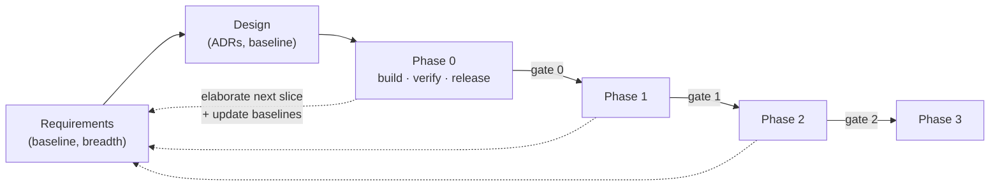

# SpanSight — Software Development Life Cycle

**Process Definition** · v1.0 · Author: Raziel Arias · Date: 2026-07-17 · Status: For review

Defines how SpanSight moves from idea to operated software: lifecycle model, the artifact each stage produces, gate criteria, change control, and document control. Tailored from public-domain practice only — ISO/IEC/IEEE 12207 process vocabulary, IEEE 29148-style requirement attributes, the C4 model, ADR practice. No employer process content (GR-1/GR-4, [REQUIREMENTS.md §2](./REQUIREMENTS.md)).

---

## 1. Lifecycle model

Phase-gated, rolling-wave iterative. Whole-project requirements and architecture are baselined once at breadth; each product phase (0–3, [REQUIREMENTS.md §5](./REQUIREMENTS.md)) then elaborates its own slice to full depth — acceptance criteria, WBS, tests — at the gate that opens it. Inside a phase, work is trunk-based and continuously integrated; `main` is always deployable, so the demo never depends on in-progress work (REQUIREMENTS §9).

Each phase internally runs the full cycle — elaborate requirements → design deltas (new ADRs as needed) → implement → verify → release → operate — so every phase ends demoable and documented.

## 2. Stages and artifacts

| Stage | Activity | Artifacts | Status (2026-07-17) |
|---|---|---|---|
| Concept & planning | Scope, goals, roadmap, budget | [REQUIREMENTS.md](./REQUIREMENTS.md) §§1–4, 9 · [IMPLEMENTATION-PLAN.md](./IMPLEMENTATION-PLAN.md) | Baselined |
| Requirements | Functional/non-functional requirements, use cases, acceptance criteria, traceability | [REQUIREMENTS.md](./REQUIREMENTS.md) (SRS) · [TRACEABILITY.md](./TRACEABILITY.md) (RTM) | v1.0 for review |
| Design | Architecture, ADRs, data model, visual design | [ARCHITECTURE.md](./ARCHITECTURE.md) · [DESIGN.md](./DESIGN.md) + [design/mockup.html](./design/mockup.html) · [HOSTING-ANALYSIS.md](./HOSTING-ANALYSIS.md) | Baselined (v0.2 / ADR-006-B) |
| Implementation | WBS execution under AI policy; conventions in repo | [IMPLEMENTATION-PLAN.md](./IMPLEMENTATION-PLAN.md) §5 · [AI-USAGE.md](./AI-USAGE.md) · `CLAUDE.md` · PR template · CI | Phase 0 in progress |
| Verification | Test strategy, plans, coverage and performance evidence | `TEST-PLAN.md` — **planned, next artifact** (formalizes ARCHITECTURE §7 testing) · CI gates | Planned (Week 2 gate) |
| Release & deployment | IaC, pipeline, release checklist, rollback | `infra/` Bicep · `.github/workflows/` (`ci.yml`, `deploy.yml`) · [RUNBOOK.md](./RUNBOOK.md) | Authored; first deploy pending RUNBOOK §1 |
| Operations & maintenance | Monitoring, cost watch, annual data refresh, incident notes | [RUNBOOK.md](./RUNBOOK.md) §5 · App Insights dashboards · budget alert (Bicep) · FR-3.4 refresh | Documented; live at first deploy |

Requirements/design baselines are living: a phase gate may amend them via change control (§4), never by silent edit.

## 3. Phase gates

A phase closes only when its gate passes. Standing checklist (extends IMPLEMENTATION-PLAN §7):

1. **Requirements met** — every in-phase FR satisfies its acceptance criteria; evidence linked from the RTM (no orphan or untested requirements).
2. **NFR spot-checks** — performance, cost, coverage, accessibility measured against REQUIREMENTS §6, method per each NFR's *Verify* tag.
3. **Ground-rules review** — GR-1…GR-7 checklist pass, recorded in the gate note (risk R-6).
4. **Docs current** — SRS slice for the next phase elaborated; RTM updated; new ADRs recorded; `CLAUDE.md` status refreshed; retro note appended to IMPLEMENTATION-PLAN.
5. **Demo live** — from `main`, publicly reachable.
6. **Budget check** — spend vs NFR-2, alert still armed.
7. **Next phase WBS** — drafted and approved; entry criteria for the next phase = this gate passed + that WBS.

Gate notes live as dated retro entries appended to IMPLEMENTATION-PLAN (per its Definition of Done, §7).

## 4. Change control

Baselined documents change only by PR, like code. A requirements change carries: the SRS edit, a change-log row (REQUIREMENTS §13), the RTM update, and — if the change surprises a reviewer — an ADR. Requirement IDs are **stable forever**: never renumbered, never reused; a dropped requirement is marked *Withdrawn* in place. Mid-phase scope additions require an explicit trade (what leaves the phase), guarding risk R-5.

## 5. Roles

| Role | Held by | Notes |
|---|---|---|
| Product owner / architect / engineer of record | Raziel | All decisions; ADRs record the reasoning ([AI-USAGE.md](./AI-USAGE.md) principle 1) |
| Implementer | AI, directed by Raziel *(AI-USAGE v1.2, 2026-07-17; [ME]/[AI] WBS tags historical)* | All build work incl. former [ME] tasks; credentials/billing stay Raziel's |
| Reviewer | CI (every PR) + AI self-review; Raziel's structured post-completion code study | v1.2 gate: green CI + policy hard rules; mastery verified in the study phase |
| Verification | CI (automated) + Raziel (demo scripts, gate checks) | CI is the impartial gatekeeper on every PR |

## 6. Document control

Controlled documents: everything in `docs/` plus `CLAUDE.md`. Conventions:

- **Status lifecycle:** Draft → For review → Baselined → (amended via §4) → Superseded.
- **Versioning:** minor bump for additive/clarifying change, major bump for re-baseline; version + date in each doc header.
- **Change history:** controlled docs with baselines carry a change-log section (e.g., REQUIREMENTS §13); ADRs are append-only (superseded ones stay, marked — see ADR-006 → ADR-006-B).
- **Single source of truth:** requirement text lives only in the SRS; other docs cite IDs. The RTM carries links, not copies.
- **Format:** markdown in-repo, reviewed by PR — the docs set ships with the product (goal G-2).

## 7. Artifact index

| Artifact | Role | Version · status |
|---|---|---|
| [REQUIREMENTS.md](./REQUIREMENTS.md) | SRS — scope, ground rules, FRs/NFRs, use cases, acceptance criteria | v1.0 · for review |
| [TRACEABILITY.md](./TRACEABILITY.md) | RTM — requirement → design → code → verification | v1.0 · for review |
| [ARCHITECTURE.md](./ARCHITECTURE.md) | Architecture + ADRs | v0.2 · baselined |
| [DESIGN.md](./DESIGN.md) · [design/mockup.html](./design/mockup.html) | Visual design spec + living mockup | v0.1 · baselined |
| [HOSTING-ANALYSIS.md](./HOSTING-ANALYSIS.md) | Hosting trade study behind ADR-006-B | v1.2 · baselined |
| [IMPLEMENTATION-PLAN.md](./IMPLEMENTATION-PLAN.md) | Toolchain, conventions, WBS, DoD, gate retros | v1.0 · baselined |
| [AI-USAGE.md](./AI-USAGE.md) | AI policy (transparency artifact) | v1.0 · baselined |
| `TEST-PLAN.md` | Test strategy & plan | planned — next artifact (Week 2 gate) |
| [RUNBOOK.md](./RUNBOOK.md) | One-time Azure setup, deploy flow, data/tiles publish, rollback, ops | v1.0 · authored 2026-07-18 |
| `CLAUDE.md` (repo root) | AI session context + current status | living |

---

*Change log: v1.0 (2026-07-17) — initial process definition, drafted per AI-USAGE division of labor (AI draft, Raziel review/approve).*
